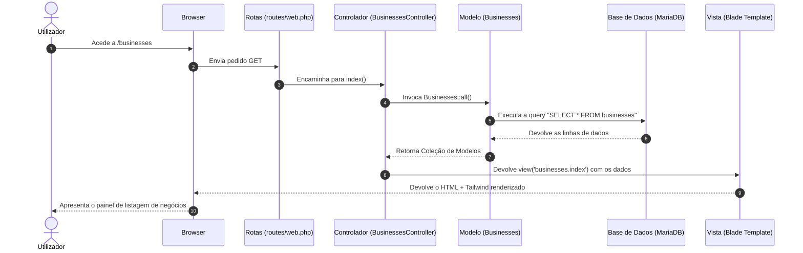

# 📖 Guia de Estudo do Projeto: Places

Este documento serve como um guia detalhado sobre a estrutura do projeto **Places**, explicando a função de cada diretório, dos ficheiros principais e o fluxo de dados da aplicação. Este guia foi desenhado para te ajudar a estudar e a compreender a arquitetura MVC (Model-View-Controller) no Laravel 12.

---

## 🏗️ 1. Arquitetura Geral e o Padrão MVC

O Laravel utiliza o padrão **MVC (Model-View-Controller)** para separar a lógica de negócio, os dados e a interface do utilizador:

1. **Model (Modelo):** Representa a estrutura de dados e as regras de negócio. Faz a ponte direta com a base de dados.
2. **View (Vista):** É a interface visual que o utilizador final vê (neste projeto, construída com Blade e Tailwind CSS).
3. **Controller (Controlador):** É o cérebro da aplicação. Recebe as ações do utilizador (através das rotas), fala com o Model para recolher ou salvar dados, e devolve a View correta com a informação.

---

## 📂 2. Estrutura Completa de Pastas

Aqui está a explicação de todas as pastas presentes na raiz do projeto:

### `app/`
É o coração da lógica da aplicação. Contém quase todo o código PHP personalizado:
* **`Http/`**: Gere o tráfego HTTP.
  * **`Controllers/`**: Contém os controladores que tratam dos pedidos (requests). Aqui encontras o [CategoryController.php](file:///home/spell/Projects/Laravel/places/app/Http/Controllers/CategoryController.php) e o [BusinessesController.php](file:///home/spell/Projects/Laravel/places/app/Http/Controllers/BusinessesController.php).
* **`Models/`**: Contém os ficheiros do Eloquent ORM (Mapeamento de Base de Dados). Cada tabela importante tem um Model correspondente (ex: [Category.php](file:///home/spell/Projects/Laravel/places/app/Models/Category.php) e [Businesses.php](file:///home/spell/Projects/Laravel/places/app/Models/Businesses.php)).

### `bootstrap/`
Guarda os ficheiros de inicialização (bootstrap) do Laravel.
* **`app.php`**: Configura os serviços essenciais, tratamento de exceções e middlewares do framework.
* **`providers.php`**: Regista os provedores de serviços internos.

### `config/`
Contém ficheiros de configuração para quase todos os aspetos do Laravel.
* **`database.php`**: Define as ligações de bases de dados (MariaDB, MySQL, SQLite, etc.).
* **`app.php`**: Fuso horário, idioma local, nome da app e chaves globais.
* **`session.php`**: Configurações de armazenamento de sessões dos utilizadores.

### `database/`
Pasta dedicada à base de dados.
* **`migrations/`**: Ficheiros PHP que atuam como "controlo de versões" da base de dados. Permitem criar e modificar tabelas de forma estruturada.
* **`factories/`**: Usado para gerar dados fictícios para testes.
* **`seeders/`**: Scripts para popular a base de dados com dados iniciais (ex: registar utilizadores de teste).

### `public/`
A pasta raiz exposta ao servidor web.
* **`index.php`**: O ponto de entrada principal de todas as requisições HTTP da aplicação.
* **`css/`** e **`js/`**: Ficheiros estáticos já compilados (como o template Tailwind Admin) servidos diretamente ao browser.

### `resources/`
Contém os ficheiros de código que ainda precisam de processamento ou compilação.
* **`views/`**: Todos os ficheiros HTML dinâmicos da aplicação (com extensão `.blade.php`).
* **`css/`** e **`js/`**: Código-fonte de estilos e scripts JavaScript antes de serem compilados pelo Vite.

### `routes/`
Define as portas de entrada da aplicação através de URLs.
* **`web.php`**: Rotas da interface gráfica que os utilizadores acedem através do browser.
* **`console.php`**: Comandos CLI personalizados executáveis via `artisan`.

### `storage/`
Utilizado para ficheiros temporários ou gerados dinamicamente pelo Laravel:
* Logs da aplicação (`storage/logs/laravel.log`).
* Ficheiros de upload dos utilizadores (`storage/app/public`).
* Ficheiros de cache e sessões de utilizadores.

### `tests/`
Ficheiros para a suite de testes automatizados.
* **`Feature/`**: Testes que simulam o comportamento real da aplicação no browser (ex: simular um login ou criação de negócio).
* **`Unit/`**: Testes focados em pequenas partes isoladas de código lógico.

### `vendor/` e `node_modules/`
Pastas que contêm as dependências instaladas do projeto.
* `vendor/` guarda as bibliotecas PHP instaladas via Composer.
* `node_modules/` guarda as bibliotecas JavaScript instaladas via NPM.

---

## 🛠️ 3. Análise Detalhada dos Ficheiros Criados/Customizados

### A. Modelos (Models)
Os modelos estendem a classe `Model` do Eloquent, facilitando as consultas SQL sem ter de escrever código SQL manual.

1. **[Category.php](file:///home/spell/Projects/Laravel/places/app/Models/Category.php)**:
   ```php
   protected $fillable = ['name', 'status'];
   ```
   * **`$fillable`**: Impede vulnerabilidades de Mass Assignment. Indica que apenas os campos `name` e `status` podem ser preenchidos diretamente a partir de um formulário.

2. **[Businesses.php](file:///home/spell/Projects/Laravel/places/app/Models/Businesses.php)**:
   ```php
   public function category() {
       return $this->belongsTo(Category::class, 'category_id');
   }
   ```
   * **`category()`**: Define uma relação do tipo "Muitos para Um" (Many-to-One). Diz ao Laravel que cada negócio pertence a uma Categoria através do campo `category_id`.

---

### B. Controladores (Controllers)
O controlador é responsável por gerir o ciclo de vida do pedido. Vejamos as principais ações no [BusinessesController.php](file:///home/spell/Projects/Laravel/places/app/Http/Controllers/BusinessesController.php):

* **`index()`**:
   1. Executa a consulta `Businesses::all()` na base de dados para obter todos os negócios.
   2. Retorna a vista `businesses.index` passando o resultado.
* **`create()`**:
   1. Executa `Category::all()` para obter a lista de categorias.
   2. Abre o formulário de criação de negócio (`businesses.create`) onde o utilizador escolhe a categoria a partir dessa lista.
* **`store(Request $request)`**:
   1. Recebe os dados introduzidos pelo utilizador através da variável `$request`.
   2. Executa `Businesses::create($request->all())` para inserir a linha na base de dados.
   3. Redireciona o utilizador de volta para a listagem com uma mensagem de sucesso no estado de sessão.
* **`edit($id)` / `update(Request $request, $id)`**:
   1. `edit` procura o negócio com `findOrFail($id)` e abre o formulário preenchido.
   2. `update` atualiza o registo correspondente na base de dados com `$business->update($request->all())`.
* **`destroy($id)`**:
   1. Procura o registo e apaga-o usando `$business->delete()`.

---

### C. Vistas (Views - Blade engine)
O Laravel utiliza o motor de templates **Blade**, que permite usar PHP simplificado diretamente no HTML.

* **[layouts/app.blade.php](file:///home/spell/Projects/Laravel/places/resources/views/layouts/app.blade.php)**:
  * Funciona como a "moldura" da aplicação.
  * O marcador `@yield('content')` indica o local onde o conteúdo específico de cada página (ex: listagem, formulário) será injetado dinamicamente.
* **Vistas de Categorias e Negócios:**
  * Usam `@extends('layouts.app')` no topo para herdar a estrutura principal definida em `layouts/app.blade.php`.
  * Usam `@section('content')` para delimitar o HTML específico que será renderizado no local do `@yield`.
  * Utilizam componentes do Tailwind CSS contidos na pasta [public/css/main.css](file:///home/spell/Projects/Laravel/places/public/css/main.css).

---

## 🔄 4. O Fluxo de Dados (Data Flow)

Para compreender como tudo funciona em conjunto, aqui está o caminho de uma requisição típica quando acedes a `http://localhost:8000/businesses`:



---

## 🔬 5. Dicionário de Sintaxe e Funções Utilizadas

Aqui encontras a explicação de todas as funções e termos chave de programação usados neste projeto:

### A. Eloquent ORM (Lógica de Base de Dados)
* **`Model::all()`**: Executa internamente uma consulta SQL `SELECT *` sobre a tabela mapeada pelo Modelo. Retorna uma coleção com todos os registos.
* **`Model::create(array $attributes)`**: Instancia um novo objeto, preenche os seus atributos de forma em massa (Mass Assignment) e grava-o na base de dados (`INSERT INTO`).
* **`Model::findOrFail($id)`**: Procura o registo com a chave primária fornecida. Se não o encontrar, dispara uma exceção HTTP 404 automaticamente (página não encontrada), prevenindo erros de execução.
* **`$instance->update(array $attributes)`**: Modifica os dados do objeto instanciado na base de dados com uma instrução SQL `UPDATE`.
* **`$instance->delete()`**: Remove permanentemente a linha associada da tabela (`DELETE FROM`).
* **`belongsTo(RelatedModel::class, 'foreign_key')`**: Define uma associação onde o modelo atual guarda a chave estrangeira que referencia outro modelo (ex: um Negócio *pertence a* uma Categoria).

### B. Controladores e Pedidos HTTP (PHP/Laravel)
* **`Request $request`**: Classe do Laravel que encapsula todos os dados do pedido HTTP (inputs de formulários, ficheiros, cabeçalhos, método HTTP e IPs).
* **`$request->all()`**: Extrai todos os dados enviados pelo formulário sob a forma de um array associativo (chave => valor).
* **`compact('var1', 'var2')`**: Função nativa do PHP que converte variáveis locais num array associativo, ideal para passar dados do controlador para as vistas. Exemplo: `compact('categories')` gera `['categories' => $categories]`.
* **`redirect()->route('name')`**: Instancia uma resposta HTTP do tipo 302 que instrui o browser a redirecionar para o URL associado a uma rota nomeada específica.
* **`->with('key', 'value')`**: Guarda uma informação temporária na Sessão da aplicação que expirará no pedido seguinte (comumente chamada de *Flash Session*), usada para exibir alertas de sucesso.

### C. Motor de Templates Blade (Frontend)
* **`{{ $variable }}`**: Ecoa o valor da variável de forma segura. O Blade passa o valor pela função `htmlspecialchars()` do PHP automaticamente, protegendo a app contra ataques de Cross-Site Scripting (XSS).
* **`@extends('layouts.app')`**: Define a herança de templates. Declara que a vista atual vai injetar código dentro do ficheiro de layout global indicado.
* **`@yield('section_name')`**: Define um ponto de inserção de conteúdo dinâmico num layout base.
* **`@section('section_name') ... @endsection`**: Delimita o bloco de conteúdo que será injetado no `@yield` correspondente do layout base.
* **`{{ route('name', $parameters) }}`**: Helper do Laravel que gera automaticamente a URL absoluta baseando-se no nome da rota e nos parâmetros passados.
* **`{{ asset('path') }}`**: Helper que gera o link correto para ficheiros guardados na pasta `public/` (como CSS, imagens ou ficheiros JS).

### D. Migrações e Construtor de Esquemas (Database Schema)
* **`Schema::create('table', function (Blueprint $table) { ... })`**: Método do construtor de bases de dados para definir a criação de uma nova tabela física.
* **`$table->id()`**: Atalho do Laravel para gerar um campo de chave primária auto-incrementável do tipo `BIGINT UNSIGNED`.
* **`$table->string('column_name', length)`**: Declara uma coluna de texto curto do tipo `VARCHAR` na base de dados (o padrão é 255 caracteres).
* **`$table->enum('column_name', ['val1', 'val2'])`**: Declara uma coluna que apenas permite guardar os valores predefinidos listados no array.
* **`$table->foreignId('column_name')`**: Cria um campo do tipo `BIGINT UNSIGNED` preparado para receber uma chave estrangeira.
* **`->constrained()`**: Aplica a restrição de chave estrangeira ao campo baseado na convenção de nomes (ex: `category_id` fará ligação com a tabela `categories`).
* **`->onDelete('cascade')`**: Regra de integridade referencial. Se o registo pai for eliminado (uma Categoria), o Laravel e a base de dados apagam automaticamente todos os registos filhos (Negócios associados).

---

## 🛠️ 6. Ferramentas e Comandos Úteis

### Ficheiro [composer.json](file:///home/spell/Projects/Laravel/places/composer.json)
Contém atalhos para tarefas recorrentes (em `scripts`):
* `composer run setup`: Faz toda a preparação inicial da máquina.
* `composer run dev`: Corre o servidor web em segundo plano.
* `composer run test`: Executa os testes unitários/funcionais.

### Comandos Artisan Relevantes (no terminal)
* `php artisan migrate`: Executa todas as migrações em falta na base de dados.
* `php artisan migrate:rollback`: Desfaz o último lote de alterações/migrações.
* `php artisan db:seed`: Preenche a base de dados com dados de teste.
* `php artisan route:list`: Mostra todas as rotas e os seus controladores correspondentes.
* `php artisan make:model NomeDoModelo -m`: Cria um modelo e uma migração em simultâneo.
